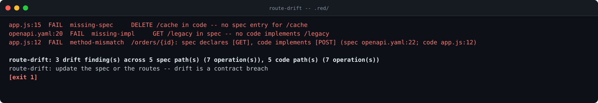
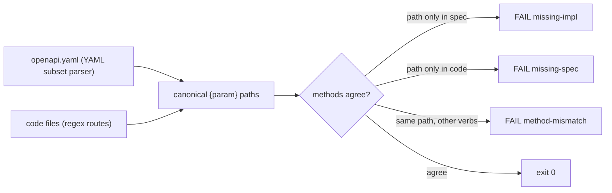

[](https://github.com/F0Rextasy/route-drift/actions/workflows/test.yml)
[](https://www.python.org/)
[](#what-it-will-never-do)
[](#what-it-will-never-do)
[](https://skills.sh/F0Rextasy/route-drift)
[](LICENSE)

# route-drift

**Your OpenAPI spec lies to your face — this gate prints the drift.** The spec says `GET /orders/{id}` exists but no handler implements it, the code serves `DELETE /cache` that no spec entry documents, one side says `GET` while the other says `POST` on the same path. `route-drift` reads your OpenAPI spec plus the route definitions in your code, maps `{param}` and `:param` styles to one canonical form, and prints every mismatch with `file:line` evidence.



## The problem is real

- Specs rot: endpoints get renamed in code while the YAML keeps the old path, handlers ship without a spec entry, verbs diverge (`GET` in the doc, `POST` in the handler) and nobody notices until a consumer breaks.
- The niche is pre-wave, not owned: OpenAPI validators check spec syntax, contract-test frameworks need a live server. Nobody has a deterministic, offline, exit-code drift gate that compares the spec against the code as text.
- Every finding here is static regex + one arithmetic pass over bytes you already have: a minimal YAML subset parser (stdlib only, no PyYAML) plus route extraction for Express, Fastify, Flask, Next.js, and generic `res.get('/x')` calls.

## Quickstart

```bash
# install the skill into any agent (Claude Code, Codex, Cursor, OpenCode, ...):
npx skills add F0Rextasy/route-drift

# or run it directly:
git clone https://github.com/F0Rextasy/route-drift

# gate a directory (spec auto-detected as openapi.yaml/yml/json):
python route-drift/route_drift.py myproject --no-color

# machine-readable report:
python route-drift/route_drift.py myproject --json
```

| Exit | Meaning |
| --- | --- |
| `0` | spec and code agree — no drift |
| `1` | drift found (`missing-impl`, `missing-spec`, `method-mismatch`) |
| `2` | usage or parse error (no spec found, unreadable spec, no `paths` mapping) |

Explicit spec file: `--spec path/to/openapi.yaml`. Full rule catalogue with the canonical-form contract: [references/RULES.md](references/RULES.md).

## Rules

Findings print `file:line  FAIL  rule  detail` — drift is a contract breach, never a warning:

| Rule | Fires when |
| --- | --- |
| `missing-impl` | `(METHOD, path)` in the spec whose path exists in no code file — implement it or drop it from the spec |
| `missing-spec` | `(METHOD, path)` in code whose path exists in no spec entry — document it or delete it |
| `method-mismatch` | same canonical path on both sides with different method sets — one finding per path, naming both sets |



Route sources: Express `app.get('/x')`, `router.route('/x').get(...)` chains, Fastify calls and `fastify.route({method, url})`, Flask `@app.route` / `@app.get` decorators, Next.js `pages/api` / `app/api` file routes, and any generic `res.get('/x')`-shaped call whose first argument starts with `/`.

## Evidence (real output)

Real output over the committed red example (also the demo above):

```console
$ python route_drift.py .red/ --no-color
app.js:15  FAIL  missing-spec     DELETE /cache in code -- no spec entry for /cache
openapi.yaml:20  FAIL  missing-impl     GET /legacy in spec -- no code implements /legacy
app.js:12  FAIL  method-mismatch  /orders/{id}: spec declares [GET], code implements [POST] (spec openapi.yaml:22; code app.js:12)

route-drift: 3 drift finding(s) across 5 spec path(s) (7 operation(s)), 5 code path(s) (7 operation(s))
route-drift: update the spec or the routes -- drift is a contract breach
[exit 1]
```

Machine-readable verdict (`--json`):

```json
{"ok": false,
 "counts": {"missing-impl": 1, "missing-spec": 1, "method-mismatch": 1,
            "spec_paths": 5, "code_paths": 5, "spec_ops": 7, "code_ops": 7}}
```

The matching routes stay quiet — `/users`, `/users/{id}`, `/health` agree on both sides, and the Express `:id` spelling maps to the spec's `{id}` form. The contract tests drive the real CLI over temp dirs:

```console
$ python -m pytest tests/ -q
......
6 passed in 1.22s
[exit 0]
```

## CI wiring

```yaml
- name: spec and routes must agree
  run: python route_drift.py src/ --no-color
- name: the red example must be caught
  run: |
    python route_drift.py --json .red/ || test $? -eq 1
```

Both steps run in this repository's [test workflow](.github/workflows/test.yml): the contract suite plus the red-fixture assertion.

## What it will never do

- **Install anything, call the network, or call a model.** Stdlib only, offline, deterministic: same bytes, same rows, same exit code.
- **Run your server or guess at runtime.** Dynamic route registration, string-concatenated paths, and unmeasurable values are out of scope — a lint that vibes is not a lint.
- **Pass quietly on a missing spec.** No spec file is a usage error (exit 2), never a green run.

## One path, many gates — the family

| repo | what it gates |
| --- | --- |
| [cigate](https://github.com/F0Rextasy/cigate) | the workflows burn each minute once — pins, path filters, dedup, budget |
| [ci-triage](https://github.com/F0Rextasy/ci-triage) | one log, one verdict: regression / flaky / infra / pass |
| [sessionaudit](https://github.com/F0Rextasy/sessionaudit) | the session behaved — scope, secrets, destructive acts, self-contradicted claims |
| [dsh-gate](https://github.com/F0Rextasy/dsh-gate) | the shell session actually ran — real commands, real files, real log |
| [docproof](https://github.com/F0Rextasy/docproof) | every README doc snippet is runnable, parsed, and verified in CI |
| [bandaid](https://github.com/F0Rextasy/bandaid) | the diff doesn't hide a silent failure — swallowed errors, dead guards |
| [testgate](https://github.com/F0Rextasy/testgate) | the tests that ran are the tests that exist — gaps, dupes, skips |
| [preflight](https://github.com/F0Rextasy/preflight) | the config is safe to ship — semantics, not syntax |
| [prove-it](https://github.com/F0Rextasy/prove-it) | every claim in this README is backed by real, captured output |
| [shipcheck](https://github.com/F0Rextasy/shipcheck) | the artifacts in `dist/` match `src/` — nothing stale ships |
| [wincompat](https://github.com/F0Rextasy/wincompat) | every path in the tree survives a Windows checkout |
| [compressproof](https://github.com/F0Rextasy/compressproof) | the context shrank without losing an answer — reversible compression, byte proof, answer-equivalence oracle |
| [uigate](https://github.com/F0Rextasy/uigate) | the UI stops looking like the same AI slop — measurable design-slop lint, WCAG + template tells |
| [aitell](https://github.com/F0Rextasy/aitell) | the prose stops reading as AI — deterministic AI-tell detection with a published confusion matrix |

## License

[MIT](LICENSE)
